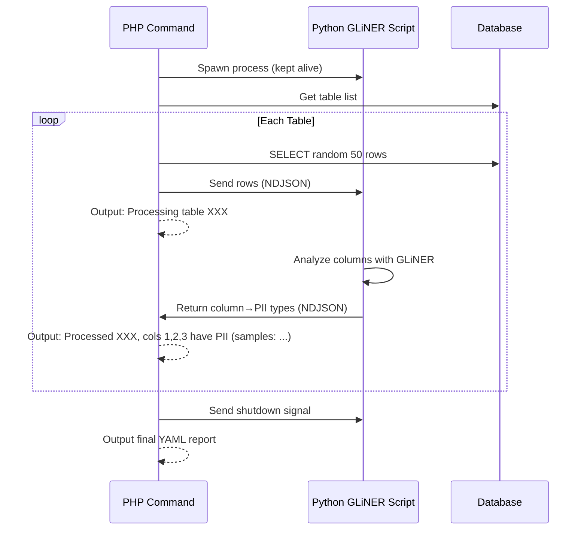
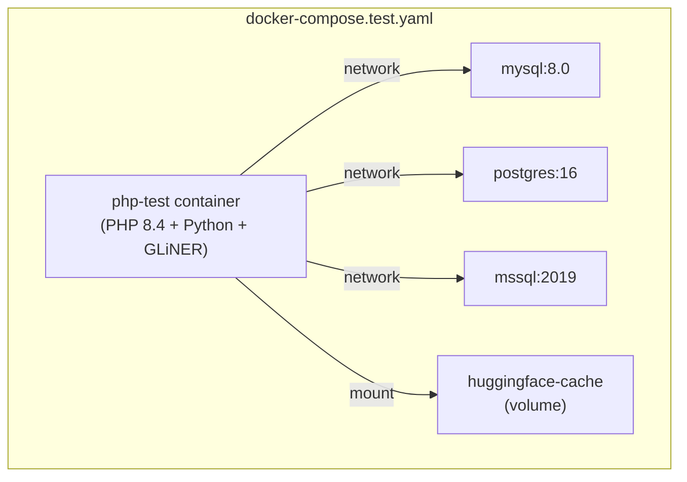

# PII Discovery Command Implementation Plan

## Overview

Add a Symfony CLI command `pii:discover` that scans database tables for Personally Identifiable Information (PII) and Protected Health Information (PHI) using NVIDIA's GLiNER-PII model. The command communicates with a Python subprocess via NDJSON (line-delimited JSON) to leverage the machine learning model.

---

## Architecture



---

## Components

### Enum Component

#### PIILabel.php

PHP backed enum containing all 55+ PII/PHI entity types with group classification.

```php
enum PIILabel: string
{
    // Personal
    case FIRST_NAME = 'first_name';
    case LAST_NAME = 'last_name';
    case DATE_OF_BIRTH = 'date_of_birth';
    // ... ~55 total cases

    public function getGroup(): PIIGroup { /* ... */ }
}
```

#### PIIGroup.php

```php
enum PIIGroup: string
{
    case PERSONAL = 'Personal';
    case CONTACT = 'Contact';
    case FINANCIAL = 'Financial';
    case GOVERNMENT = 'Government';
    case DIGITAL = 'Digital/Technical';
    case HEALTHCARE = 'Healthcare/PHI';
    case TEMPORAL = 'Temporal';
    case ORGANIZATION = 'Organization';
}
```

---

### Command Component

#### PIIDiscoveryCommand.php

Main CLI command with the following signature:

```bash
php bin/console pii:discover --connection=<name> [options]
```

**Options:**
| Option | Required | Default | Description |
|--------|----------|---------|-------------|
| `--connection` | ✓ | - | Database connection name to scan |
| `--tables` | ✗ | all | Comma-separated list of specific tables |
| `--sample-size` | ✗ | 50 | Number of random rows to sample per table |
| `--confidence-threshold` | ✗ | 0.9 | Minimum confidence (0.0-1.0) to flag PII |

**Execution Flow:**

1. Load and validate doctrine config via `DoctrineConfigLoader`
2. Validate `--connection` exists
3. Spawn Python GLiNER subprocess (persistent)
4. Get table list (filtered by `--tables` if provided)
5. For each table:
    - Query random N rows (up to `--sample-size`, or all if fewer exist)
    - Send to Python via NDJSON
    - Output info: `Processing table {table}...`
    - Receive response, store results
    - Output info: `Processed {table}, columns [{cols}] contain PII (samples: {examples})`
6. Send shutdown to Python, wait for exit
7. Output final YAML report

---

### Service Component

#### PIIAnalyzerService.php

Manages Python subprocess lifecycle and communication:

```php
class PIIAnalyzerService
{
    public function start(): void;           // Spawn Python process
    public function analyze(array $rows): array;  // Send data, get results
    public function stop(): void;            // Graceful shutdown
}
```

**NDJSON Protocol:**

Request (PHP → Python):

```json
{"action": "analyze", "table": "users", "columns": ["name", "email"], "data": [["John", "j@x.com"], ...], "threshold": 0.9}
```

Response (Python → PHP):

```json
{
    "table": "users",
    "results": { "email": ["email"], "name": ["first_name"] },
    "samples": { "email": "j@x.com" }
}
```

Shutdown:

```json
{ "action": "shutdown" }
```

---

### Python Script

#### gliner_pii.py

Simple Python script that:

1. Loads GLiNER-PII model on startup
2. Reads NDJSON from stdin
3. For each request:
    - Combines column data into text
    - Runs `model.predict_entities()` with all 55+ labels
    - Filters by confidence threshold (passed in request)
    - Returns column→PII types mapping + sample values
4. Exits on shutdown action

---

## Testing Strategy

### Test Container Architecture

Since the PII detection requires Python with GLiNER, we use a development/test Docker image that includes both PHP and Python dependencies.



**Composer Scripts:**

| Script         | Description                                         |
| -------------- | --------------------------------------------------- |
| `tests`        | Run tests locally (no Python/GLiNER)                |
| `tests-docker` | Run all tests inside container (includes PII tests) |
| `tests-pii`    | Run only PII integration tests inside container     |

---

## Complete PII Labels List

Based on Nemotron-PII dataset research, here are all ~55 entity types organized by group:

| Group                 | Labels                                                                                                                                                                                         |
| --------------------- | ---------------------------------------------------------------------------------------------------------------------------------------------------------------------------------------------- |
| **Personal**          | `first_name`, `last_name`, `name`, `date_of_birth`, `age`, `gender`, `sexuality`, `race_ethnicity`, `religious_belief`, `political_view`, `occupation`, `employment_status`, `education_level` |
| **Contact**           | `email`, `phone_number`, `street_address`, `city`, `county`, `state`, `country`, `coordinate`, `zip_code`, `po_box`                                                                            |
| **Financial**         | `credit_debit_card`, `cvv`, `bank_routing_number`, `account_number`, `iban`, `swift_bic`, `pin`, `ssn`, `tax_id`, `ein`                                                                        |
| **Government**        | `passport_number`, `driver_license`, `license_plate`, `national_id`, `voter_id`                                                                                                                |
| **Digital/Technical** | `ipv4`, `ipv6`, `mac_address`, `url`, `user_name`, `password`, `device_identifier`, `imei`, `serial_number`, `api_key`, `secret_key`                                                           |
| **Healthcare/PHI**    | `medical_record_number`, `health_plan_beneficiary_number`, `blood_type`, `biometric_identifier`, `health_condition`, `medication`, `insurance_policy_number`                                   |
| **Temporal**          | `date`, `time`, `date_time`                                                                                                                                                                    |
| **Organization**      | `company_name`, `employee_id`, `customer_id`, `certificate_license_number`, `vehicle_identifier`                                                                                               |

---

## Error Handling

| Scenario                            | Behavior                                          |
| ----------------------------------- | ------------------------------------------------- |
| Table has < N records               | Use all available records                         |
| Python script fails/times out       | Show error message and exit with failure code     |
| Connection has no tables            | Output message and exit successfully              |
| Invalid connection name             | Show error and exit                               |
| Python not installed / missing deps | Show helpful error with installation instructions |

---

## Output Format

Final YAML output to console:

```yaml
users:
    email:
        - email
    name:
        - first_name
        - last_name
    phone:
        - phone_number

orders:
    billing_address:
        - street_address
        - city
        - state
```
