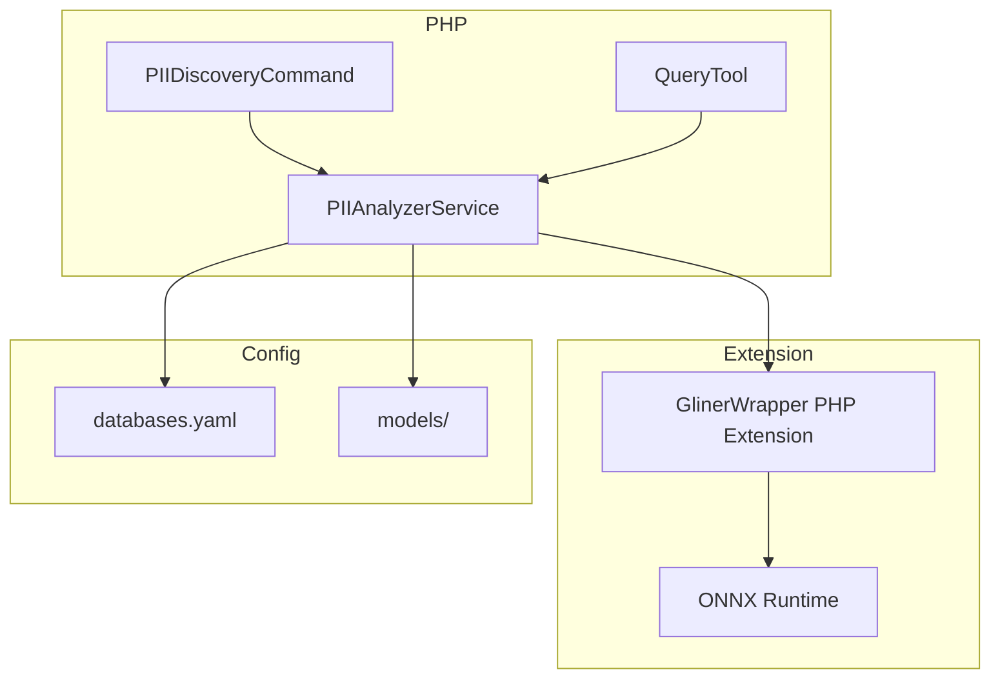

# PII Discovery Implementation Plan

## Overview

PII (Personally Identifiable Information) detection using GLiNER ONNX model via native PHP extension.

---

## Architecture


```mermaid
graph TB
    subgraph PHP
        PIICmd[PIIDiscoveryCommand]
        PIISvc[PIIAnalyzerService]
        QueryTool[QueryTool]
    end

    subgraph Extension
        Gliner[GlinerWrapper PHP Extension]
        ONNX[ONNX Runtime]
    end

    subgraph Config
        YAML[databases.yaml]
        Models[models/]
    end

    PIICmd --> PIISvc
    QueryTool --> PIISvc
    PIISvc --> Gliner
    Gliner --> ONNX
    PIISvc --> YAML
    PIISvc --> Models
```

---

## Components

### PIIAnalyzerService

Core service using `GlinerWrapper` PHP extension:

- `start()` - Load model from configured paths
- `analyze()` - Detect PII types in table columns
- `redact()` - Replace PII values with `[REDACTED_type]`
- `stop()` - Release resources

### Configuration

YAML config with `pii` section:

```yaml
pii:
    tokenizer_path: "models/tokenizer.json"
    model_path: "models/model.onnx"
```

### GlinerWrapper Extension

Native PHP extension (Rust-based):

```php
$gliner = new GlinerWrapper($tokenizerPath, $modelPath);
$results = $gliner->predictBatch($texts, $labels);
```

Returns entities with: `text`, `label`, `score`, `start`, `end`, `sequence`

---

## PII Labels (64 types)

| Group        | Labels                                                        |
| ------------ | ------------------------------------------------------------- |
| Personal     | first_name, last_name, name, date_of_birth, age, gender, etc. |
| Contact      | email, phone_number, street_address, city, zip_code, etc.     |
| Financial    | credit_debit_card, ssn, iban, account_number, etc.            |
| Government   | passport_number, driver_license, national_id, etc.            |
| Digital      | ipv4, ipv6, mac_address, api_key, password, etc.              |
| Healthcare   | medical_record_number, blood_type, medication, etc.           |
| Temporal     | date, time, date_time                                         |
| Organization | company_name, employee_id, customer_id, etc.                  |

---

## Installation

1. Install GLiNER PHP extension
2. Download model files (~1.8GB)
3. Configure paths in YAML

See [walkthrough.md](pii-discovery-walkthrough.md) for details.
