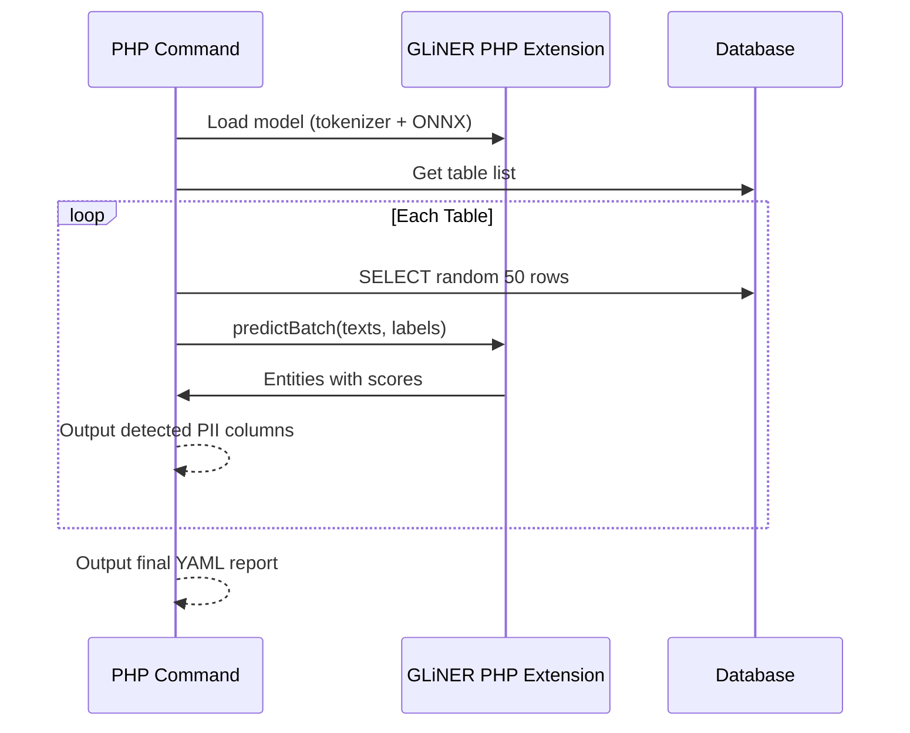

# PII Discovery Feature Walkthrough

This document provides a walkthrough of the PII Discovery feature implementation.

## Feature Overview

The `pii:discover` command scans database tables for Personally Identifiable Information (PII) and Protected Health Information (PHI) using NVIDIA's GLiNER-PII model via the native PHP extension.

## Architecture



## Files

### Core Files

| File                                  | Description                                                |
| ------------------------------------- | ---------------------------------------------------------- |
| `src/Service/PIIAnalyzerService.php`  | Service using GLiNER PHP extension for detection/redaction |
| `src/Command/PIIDiscoveryCommand.php` | CLI command for PII scanning                               |
| `src/Enum/PIILabel.php`               | Enum with 64 PII/PHI entity types                          |
| `src/Enum/PIIGroup.php`               | Enum with 8 PII categories                                 |
| `stubs/GlinerWrapper.php`             | IDE stubs for the PHP extension                            |

### Configuration

| File                    | Description                                           |
| ----------------------- | ----------------------------------------------------- |
| `databases.yaml`        | Database connections + `pii` section with model paths |
| `models/tokenizer.json` | GLiNER tokenizer (~8MB)                               |
| `models/model.onnx`     | GLiNER ONNX model (~1.8GB)                            |

---

## Configuration

Add `pii` section to your database config YAML:

```yaml
doctrine:
    dbal:
        connections:
            production:
                url: "mysql://..."
                pii_enabled: true # Enable PII redaction for this connection

pii:
    tokenizer_path: "models/tokenizer.json"
    model_path: "models/model.onnx"
```

---

## Usage

### Basic Usage

```bash
# Scan all tables in a connection
php bin/console pii:discover --connection=production

# Scan specific tables only
php bin/console pii:discover -c production --tables=users,orders,customers

# Customize sample size and confidence threshold
php bin/console pii:discover -c production -s 100 --confidence-threshold=0.8
```

---

## Requirements

1. **GLiNER PHP Extension** - Install from [gliner-rs-php releases](https://github.com/ineersa/gliner-rs-php/releases):

```bash
# Download and extract
curl -fsSL -o gliner.tar.gz https://github.com/ineersa/gliner-rs-php/releases/download/0.0.6/gliner-rs-php-0.0.6-linux-x86_64.tar.gz
tar -xzf gliner.tar.gz

# Install extension
cp libgliner_rs_php.so /usr/local/lib/php/extensions/
echo "extension=/usr/local/lib/php/extensions/libgliner_rs_php.so" > /usr/local/etc/php/conf.d/gliner_rs_php.ini
```

2. **Model Files** - Place in `models/` directory:
    - `tokenizer.json`
    - `model.onnx`

---

## PII Entity Types

The system detects 64 entity types across 8 categories:

| Category              | Types                                                                                                                                                                |
| --------------------- | -------------------------------------------------------------------------------------------------------------------------------------------------------------------- |
| **Personal**          | first_name, last_name, name, date_of_birth, age, gender, sexuality, race_ethnicity, religious_belief, political_view, occupation, employment_status, education_level |
| **Contact**           | email, phone_number, street_address, city, county, state, country, coordinate, zip_code, po_box                                                                      |
| **Financial**         | credit_debit_card, cvv, bank_routing_number, account_number, iban, swift_bic, pin, ssn, tax_id, ein                                                                  |
| **Government**        | passport_number, driver_license, license_plate, national_id, voter_id                                                                                                |
| **Digital/Technical** | ipv4, ipv6, mac_address, url, user_name, password, device_identifier, imei, serial_number, api_key, secret_key                                                       |
| **Healthcare/PHI**    | medical_record_number, health_plan_beneficiary_number, blood_type, biometric_identifier, health_condition, medication, insurance_policy_number                       |
| **Temporal**          | date, time, date_time                                                                                                                                                |
| **Organization**      | company_name, employee_id, customer_id, certificate_license_number, vehicle_identifier                                                                               |

---

## Example Output

```text
PII Discovery
=============

 Connection: products
 Tables to scan: 3
 Sample size: 50 rows per table
 Confidence threshold: 90.0%

 Loading GLiNER model...
 GLiNER ready

Processing table pii_samples... Done
 ---------------- ----------------------- ----------------------
  Column           PII Type(s)             Sample
 ---------------- ----------------------- ----------------------
  customer_name    first_name, last_name   Jane Doe
  customer_email   email                   jane.doe@company.org
  ip_address       ipv4                    192.168.1.100
 ---------------- ----------------------- ----------------------

Processing table users... Done
 -------- ------------- -------------------
  Column   PII Type(s)   Sample
 -------- ------------- -------------------
  name     first_name    Frank
  email    email         frank@example.com
 -------- ------------- -------------------
```

---

## Running Tests

```bash
# Run all tests inside Docker container
composer tests

# Run only PII-specific tests
composer test -- tests/Command/PIIDiscoveryCommandTest.php
composer test -- tests/Service/PIIAnalyzerServiceTest.php
```

---

## Troubleshooting

### Extension Not Found

```
GLiNER PHP extension not installed.
```

Ensure the extension is installed and enabled in php.ini:

```bash
php -m | grep gliner
```

### Model Files Not Found

```
Tokenizer file not found: models/tokenizer.json
```

Download model files and place them in the configured paths.

### Low Confidence Results

Increase sample size or lower confidence threshold:

```bash
php bin/console pii:discover -c prod --sample-size=200 --confidence-threshold=0.7
```
